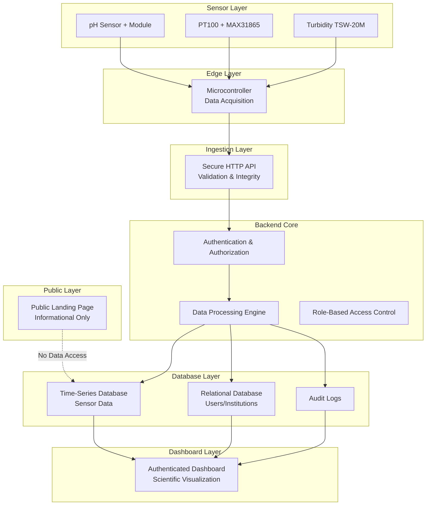
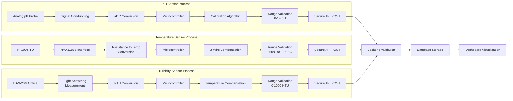
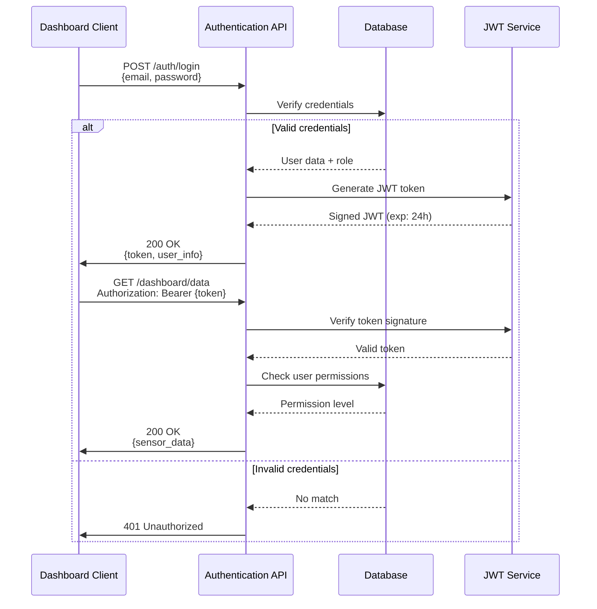

# 📋 DOCUMENTACIÓN TÉCNICA COMPLETA - M_A_N_G_O
## Monitoring of Aquatic & Natural Global Observations

---

## 📌 ÍNDICE DE DOCUMENTACIÓN

### 1. ARQUITECTURA GENERAL DEL SISTEMA

#### 1.1 Diagrama de Arquitectura del Sistema



#### 1.2 Matriz de Roles y Permisos

| Rol | Descripción | Permisos | Acceso Dashboard | Registro Sensores |
|-----|-------------|----------|------------------|-------------------|
| Super Admin | Administrador del sistema | Total | ✅ | ✅ |
| Institution Admin | Admin de institución | Gestionar usuarios institucionales | ✅ | ✅ |
| Researcher | Científico/investigador | Visualización datos, análisis | ✅ | ❌ |
| Technician | Técnico de campo | Mantenimiento sensores, calibración | ✅ | Limitado |
| Viewer | Visualizador básico | Solo lectura de datos públicos | ✅ | ❌ |
| Public | Visitante landing page | Información general | ❌ | ❌ |

---

### 2. ESQUEMAS DE BASE DE DATOS

#### 2.1 Diagrama Entidad-Relación (ERD)

```sql
-- Tabla: institutions
CREATE TABLE institutions (
    id UUID PRIMARY KEY DEFAULT gen_random_uuid(),
    name VARCHAR(255) NOT NULL UNIQUE,
    type VARCHAR(50) NOT NULL CHECK (type IN ('NGO', 'UNIVERSITY', 'FOUNDATION', 'SCHOOL', 'MINISTRY', 'COMPANY')),
    contact_email VARCHAR(255) NOT NULL,
    contact_phone VARCHAR(50),
    address TEXT,
    api_key_hash VARCHAR(256) NOT NULL UNIQUE,
    status VARCHAR(20) DEFAULT 'active' CHECK (status IN ('active', 'suspended', 'inactive')),
    created_at TIMESTAMP DEFAULT CURRENT_TIMESTAMP,
    updated_at TIMESTAMP DEFAULT CURRENT_TIMESTAMP
);

-- Tabla: users
CREATE TABLE users (
    id UUID PRIMARY KEY DEFAULT gen_random_uuid(),
    institution_id UUID NOT NULL REFERENCES institutions(id) ON DELETE CASCADE,
    email VARCHAR(255) NOT NULL UNIQUE,
    username VARCHAR(100) NOT NULL UNIQUE,
    password_hash VARCHAR(256) NOT NULL,
    role VARCHAR(50) NOT NULL CHECK (role IN ('super_admin', 'institution_admin', 'researcher', 'technician', 'viewer')),
    first_name VARCHAR(100),
    last_name VARCHAR(100),
    phone VARCHAR(50),
    last_login TIMESTAMP,
    is_active BOOLEAN DEFAULT TRUE,
    created_at TIMESTAMP DEFAULT CURRENT_TIMESTAMP,
    updated_at TIMESTAMP DEFAULT CURRENT_TIMESTAMP
);

-- Tabla: sensors
CREATE TABLE sensors (
    id UUID PRIMARY KEY DEFAULT gen_random_uuid(),
    institution_id UUID NOT NULL REFERENCES institutions(id) ON DELETE CASCADE,
    sensor_type VARCHAR(50) NOT NULL CHECK (sensor_type IN ('pH', 'temperature', 'turbidity')),
    sensor_model VARCHAR(100) NOT NULL,
    serial_number VARCHAR(100) UNIQUE NOT NULL,
    location_name VARCHAR(255) NOT NULL,
    latitude DECIMAL(10, 8) NOT NULL,
    longitude DECIMAL(11, 8) NOT NULL,
    installation_date DATE NOT NULL,
    calibration_date DATE,
    status VARCHAR(20) DEFAULT 'active' CHECK (status IN ('active', 'maintenance', 'decommissioned')),
    metadata JSONB,
    created_at TIMESTAMP DEFAULT CURRENT_TIMESTAMP,
    updated_at TIMESTAMP DEFAULT CURRENT_TIMESTAMP
);

-- Tabla: sensor_data (Time-Series)
CREATE TABLE sensor_data (
    id BIGSERIAL PRIMARY KEY,
    sensor_id UUID NOT NULL REFERENCES sensors(id) ON DELETE CASCADE,
    timestamp TIMESTAMP WITH TIME ZONE NOT NULL,
    value DECIMAL(12, 6) NOT NULL,
    unit VARCHAR(20) NOT NULL,
    quality_flag VARCHAR(20) DEFAULT 'valid' CHECK (quality_flag IN ('valid', 'questionable', 'invalid', 'missing')),
    raw_value VARCHAR(100),
    metadata JSONB,
    created_at TIMESTAMP DEFAULT CURRENT_TIMESTAMP
);

-- Índices para rendimiento
CREATE INDEX idx_sensor_data_sensor_id ON sensor_data(sensor_id);
CREATE INDEX idx_sensor_data_timestamp ON sensor_data(timestamp DESC);
CREATE INDEX idx_sensor_data_quality ON sensor_data(quality_flag);
CREATE INDEX idx_sensors_institution ON sensors(institution_id);
CREATE INDEX idx_users_institution ON users(institution_id);
```

---

### 3. PROCESOS DE SENSORES Y FLUJO DE DATOS

#### 3.1 Diagrama de Flujo de Datos por Sensor



#### 3.2 Especificaciones Técnicas de Sensores

**pH Sensor:**
- Rango: 0-14 pH
- Precisión: ±0.1 pH
- Resolución: 0.01 pH
- Frecuencia de muestreo: 1 lectura/5min
- Validación: Rechaza valores <0 o >14

**PT100 Temperature Sensor:**
- Rango: -50°C a +150°C
- Precisión: ±0.3°C (típico)
- Resolución: 0.01°C
- Configuración: 3-wire RTD con MAX31865
- Validación: Rechaza valores fuera de rango operativo

**Turbidity Sensor TSW-20M:**
- Rango: 0-1000 NTU
- Precisión: ±5% del valor medido
- Resolución: 0.1 NTU
- Principio: Dispersión de luz (90°)
- Validación: Rechaza valores negativos o >1000 NTU

---

### 4. FLUJO DE AUTENTICACIÓN Y AUTORIZACIÓN



---

### 5. COMANDOS Y OPERACIONES DEL SISTEMA

#### 5.1 Estructura de Carpetas del Proyecto

```
m_a_n_g_o/
├── backend/
│   ├── src/
│   │   ├── auth/
│   │   │   ├── authentication.py
│   │   │   ├── authorization.py
│   │   │   └── jwt_handler.py
│   │   ├── database/
│   │   │   ├── models.py
│   │   │   ├── queries.py
│   │   │   └── migrations/
│   │   ├── sensors/
│   │   │   ├── ingestion.py
│   │   │   ├── validation.py
│   │   │   └── processing.py
│   │   ├── api/
│   │   │   ├── routes.py
│   │   │   ├── middleware.py
│   │   │   └── validators.py
│   │   ├── dashboard/
│   │   │   ├── visualization.py
│   │   │   └── analytics.py
│   │   └── main.py
│   ├── tests/
│   ├── requirements.txt
│   └── .env.example
├── frontend/
│   ├── dashboard/
│   │   ├── src/
│   │   ├── public/
│   │   └── package.json
│   └── landing/
│       ├── src/
│       ├── public/
│       └── package.json
├── database/
│   ├── init.sql
│   ├── migrations/
│   └── backup/
├── docs/
│   ├── architecture.md
│   ├── api_reference.md
│   └── user_manual.md
├── scripts/
│   ├── deploy.sh
│   ├── backup.sh
│   └── sensor_setup.py
└── docker-compose.yml
```

#### 5.2 Archivo de Configuración (.env)

```env
# Database Configuration
DB_HOST=localhost
DB_PORT=5432
DB_NAME=mango_monitoring
DB_USER=mango_admin
DB_PASSWORD=secure_password_here
DB_POOL_SIZE=20
DB_MAX_OVERFLOW=10

# JWT Configuration
JWT_SECRET_KEY=your_super_secret_jwt_key_here_change_in_production
JWT_ALGORITHM=HS256
JWT_ACCESS_TOKEN_EXPIRE_MINUTES=1440

# API Configuration
API_HOST=0.0.0.0
API_PORT=8000
API_VERSION=v1
DEBUG=false

# Security
ALLOWED_ORIGINS=https://dashboard.mango-monitoring.org,https://api.mango-monitoring.org
RATE_LIMIT_PER_MINUTE=60
MAX_REQUEST_SIZE_MB=10

# Sensor Configuration
SENSOR_DATA_RETENTION_DAYS=3650
VALIDATION_STRICT_MODE=true
AUTO_REJECT_OUT_OF_RANGE=true

# Logging
LOG_LEVEL=INFO
LOG_FILE=/var/log/mango/backend.log
AUDIT_LOG_ENABLED=true

# Email (for notifications)
SMTP_HOST=smtp.mango-monitoring.org
SMTP_PORT=587
SMTP_USER=noreply@mango-monitoring.org
SMTP_PASSWORD=email_password_here
```

#### 5.3 Comandos de Inicialización

**Desarrollo:**
```bash
# Backend
cd backend
python -m venv venv
source venv/bin/activate
pip install -r requirements.txt
python src/main.py --mode development

# Database
psql -U postgres -c "CREATE DATABASE mango_monitoring;"
psql -U mango_admin -d mango_monitoring -f database/init.sql
python src/database/migrations/run_migrations.py

# Frontend Dashboard
cd frontend/dashboard
npm install
npm run dev

# Frontend Landing
cd frontend/landing  
npm install
npm run dev
```

**Producción:**
```bash
# Usando Docker Compose
docker-compose up -d --build

# O manualmente
cd backend
gunicorn src.main:app -w 4 -k uvicorn.workers.UvicornWorker --bind 0.0.0.0:8000

cd frontend/dashboard
npm run build
serve -s dist -l 3000

cd frontend/landing
npm run build
serve -s dist -l 80
```

---

### 6. GUÍAS Y PROCEDIMIENTOS

#### 6.1 Guía: Añadir un Nuevo Sensor

**Paso 1: Preparación Física**
```python
# Calibración inicial del sensor
def calibrate_sensor(sensor_type, calibration_values):
    """
    Calibración de sensores antes de despliegue
    
    Args:
        sensor_type: 'pH', 'temperature', 'turbidity'
        calibration_values: dict con valores de calibración
    """
    if sensor_type == 'pH':
        # Calibración de 2 o 3 puntos
        buffer_4 = calibration_values.get('buffer_4')
        buffer_7 = calibration_values.get('buffer_7')
        buffer_10 = calibration_values.get('buffer_10')
        # Proceso de calibración...
    
    elif sensor_type == 'temperature':
        # Verificación PT100 con baño de hielo (0°C) y agua hirviendo (100°C)
        ice_bath_reading = calibration_values.get('ice_bath')
        boiling_water_reading = calibration_values.get('boiling_water')
        # Cálculo de compensación...
    
    elif sensor_type == 'turbidity':
        # Calibración con estándares Formazin
        zero_standard = calibration_values.get('zero_standard')
        formazin_standard = calibration_values.get('formazin_standard')
        # Ajuste de curva...
```

**Paso 2: Registro en Sistema**
```sql
-- Registrar nuevo sensor en base de datos
INSERT INTO sensors (
    institution_id,
    sensor_type,
    sensor_model,
    serial_number,
    location_name,
    latitude,
    longitude,
    installation_date,
    calibration_date,
    metadata
) VALUES (
    'institution-uuid-here',
    'pH',  -- o 'temperature', 'turbidity'
    'Atlas Scientific pH Probe',
    'PH-2024-001',
    'Río Amazonas - Estación Norte',
    -3.4653,
    -62.2159,
    CURRENT_DATE,
    CURRENT_DATE,
    '{"calibration_constants": {"slope": 1.02, "offset": 0.05},
      "installation_depth": "0.5m",
      "power_source": "solar"}'
);
```

**Paso 3: Configuración de Microcontrolador**
```cpp
// Configuración para ESP32/Arduino
#include <WiFi.h>
#include <HTTPClient.h>

const char* API_ENDPOINT = "https://api.mango-monitoring.org/v1/sensor-data";
const char* API_KEY = "institution_api_key_here";
const char* SENSOR_ID = "sensor-uuid-here";

void sendSensorData(float value, String unit) {
    if (WiFi.status() == WL_CONNECTED) {
        HTTPClient http;
        http.begin(API_ENDPOINT);
        http.addHeader("Content-Type", "application/json");
        http.addHeader("Authorization", "Bearer " + String(API_KEY));
        
        String payload = "{\"sensor_id\":\"" + String(SENSOR_ID) + 
                         "\",\"timestamp\":\"" + getISO8601Time() +
                         "\",\"value\":" + String(value) +
                         ",\"unit\":\"" + unit + "\"}";
        
        int httpResponseCode = http.POST(payload);
        
        if (httpResponseCode == 201) {
            Serial.println("Data sent successfully");
        } else {
            Serial.println("Error sending  " + String(httpResponseCode));
            // Implement retry logic
        }
        
        http.end();
    }
}
```

#### 6.2 Guía: Registrar Nueva Institución

**Proceso Administrativo:**
1. Solicitud formal por parte de la institución
2. Verificación de credenciales institucionales
3. Evaluación de propósito de uso (debe ser ambiental/científico)
4. Firma de acuerdo de uso responsable
5. Creación de cuenta institucional

**Implementación Técnica:**
```python
from backend.src.auth.authorization import create_institution_account

def register_new_institution(institution_data):
    """
    Registro de nueva institución autorizada
    
    Args:
        institution_ dict con información institucional
        
    Returns:
        dict: credenciales y API key
    """
    # Validación de datos
    required_fields = ['name', 'type', 'contact_email', 'address']
    for field in required_fields:
        if field not in institution_
            raise ValueError(f"Missing required field: {field}")
    
    # Verificación de tipo de institución
    valid_types = ['NGO', 'UNIVERSITY', 'FOUNDATION', 'SCHOOL', 'MINISTRY', 'COMPANY']
    if institution_data['type'] not in valid_types:
        raise ValueError(f"Invalid institution type")
    
    # Generación de API key segura
    import secrets
    api_key = secrets.token_urlsafe(32)
    api_key_hash = hash_password(api_key)
    
    # Creación en base de datos
    institution_id = database.create_institution(
        name=institution_data['name'],
        type=institution_data['type'],
        contact_email=institution_data['contact_email'],
        contact_phone=institution_data.get('contact_phone'),
        address=institution_data['address'],
        api_key_hash=api_key_hash
    )
    
    # Creación de admin inicial
    admin_user = database.create_user(
        institution_id=institution_id,
        email=institution_data['admin_email'],
        username=institution_data['admin_username'],
        password=institution_data['admin_password'],
        role='institution_admin',
        first_name=institution_data.get('admin_first_name'),
        last_name=institution_data.get('admin_last_name')
    )
    
    return {
        'institution_id': institution_id,
        'api_key': api_key,  # Solo mostrado una vez
        'admin_credentials': {
            'username': admin_user.username,
            'temporary_password': institution_data['admin_password']
        }
    }
```

---

### 7. FASES DEL PROYECTO

#### 7.1 Roadmap Detallado

**Phase 1: Core Backend + Real Sensor Ingestion** ✅ COMPLETED
- [x] Arquitectura backend REST API
- [x] Sistema de autenticación JWT
- [x] Base de datos time-series para datos de sensores
- [x] Validación de datos en tiempo real
- [x] Integración con 3 sensores físicos (pH, temperatura, turbidez)
- [x] API de ingesta segura HTTP

**Phase 2: Secure Dashboard and Data Visualization** 🔄 IN PROGRESS
- [ ] Interfaz de dashboard autenticada
- [ ] Visualización de series temporales
- [ ] Gráficos científicos (matplotlib.js, D3.js)
- [ ] Exportación de datos (CSV, JSON)
- [ ] Alertas básicas de umbrales
- [ ] Panel de estado de sensores

**Phase 3: Multi-Institution Access Control** 📋 PLANNED
- [ ] Sistema RBAC avanzado
- [ ] Gestión de usuarios por institución
- [ ] Aislamiento de datos entre instituciones
- [ ] API keys por institución
- [ ] Auditoría completa de accesos

**Phase 4: Advanced Analytics and Alerts** 📋 PLANNED
- [ ] Análisis estadístico de datos
- [ ] Detección de anomalías
- [ ] Sistema de alertas programables
- [ ] Reportes automáticos
- [ ] Machine learning para predicciones

**Phase 5: Expansion** 📋 PLANNED
- [ ] Protocolo MQTT para ingesta
- [ ] Soporte para nuevos tipos de sensores
- [ ] Escalabilidad horizontal
- [ ] Integración con APIs externas
- [ ] Sistema de backup y recuperación

---

### 8. ESPECIFICACIONES TÉCNICAS COMPLETAS

#### 8.1 API Reference

**Endpoint: POST /v1/sensor-data**
```json
{
  "sensor_id": "uuid-del-sensor",
  "timestamp": "2026-02-04T10:30:00Z",
  "value": 7.45,
  "unit": "pH",
  "quality_flag": "valid",
  "raw_value": "512",
  "metadata": {
    "battery_level": "85%",
    "signal_strength": "-65dBm"
  }
}
```

**Validación:**
- `sensor_id`: UUID válido existente en base de datos
- `timestamp`: ISO 8601 format, no futuro
- `value`: Decimal dentro de rango del tipo de sensor
- `unit`: Debe coincidir con el tipo de sensor
- `quality_flag`: Uno de ['valid', 'questionable', 'invalid', 'missing']

**Respuestas:**
- 201 Created: Datos aceptados y almacenados
- 400 Bad Request: Datos inválidos
- 401 Unauthorized: API key inválida
- 404 Not Found: Sensor no existe
- 422 Unprocessable Entity: Validación fallida

---

### 9. MONITOREO Y MANTENIMIENTO

#### 9.1 Health Check Endpoints

```python
# Endpoint para monitoreo del sistema
@app.get("/health")
async def health_check():
    return {
        "status": "healthy",
        "timestamp": datetime.utcnow().isoformat(),
        "database": await check_database_connection(),
        "active_sensors": await get_active_sensor_count(),
        "data_points_today": await get_today_data_count(),
        "system_load": get_system_load()
    }

# Endpoint para estado específico de sensores
@app.get("/sensors/{sensor_id}/status")
async def sensor_status(sensor_id: UUID):
    sensor = await get_sensor_by_id(sensor_id)
    last_reading = await get_last_reading(sensor_id)
    
    return {
        "sensor_id": sensor_id,
        "status": sensor.status,
        "last_reading": {
            "timestamp": last_reading.timestamp,
            "value": last_reading.value,
            "quality": last_reading.quality_flag
        },
        "uptime": calculate_uptime(sensor),
        "maintenance_due": sensor.next_maintenance_date
    }
```

#### 9.2 Procedimiento de Mantenimiento de Sensores

```python
def sensor_maintenance_procedure(sensor_id):
    """
    Procedimiento completo de mantenimiento de sensor
    
    Checklist:
    1. Verificación física del sensor
    2. Limpieza de componentes
    3. Recalibración
    4. Prueba de comunicación
    5. Actualización de metadatos
    """
    
    # 1. Verificación física
    physical_check = perform_physical_inspection(sensor_id)
    
    # 2. Limpieza (dependiendo del tipo)
    clean_sensor(sensor_id)
    
    # 3. Recalibración
    calibration_results = recalibrate_sensor(sensor_id)
    
    # 4. Prueba de comunicación
    communication_test = test_sensor_communication(sensor_id)
    
    # 5. Actualizar metadatos
    update_sensor_metadata(
        sensor_id,
        last_maintenance_date=datetime.now(),
        calibration_data=calibration_results,
        maintenance_notes="Routine maintenance performed"
    )
    
    # Notificar al técnico
    notify_technician(sensor_id, "Maintenance completed successfully")
```

---

## 📊 RESUMEN EJECUTIVO

**M_A_N_G_O** es un sistema institucional de monitoreo ambiental de grado científico con:

- ✅ **3 sensores físicos** operativos (pH, temperatura, turbidez)
- ✅ **Arquitectura modular** segura y escalable
- ✅ **Acceso restringido** a instituciones autorizadas
- ✅ **Datos reales** en tiempo continuo, sin simulación
- ✅ **Seguridad de primer nivel** (JWT, RBAC, validación estricta)
- ✅ **Base de datos time-series** optimizada para datos ambientales
- ✅ **Dashboard científico** para análisis y visualización

**Próximos hitos:**
- Completar Phase 2 (Dashboard Visualization)
- Implementar sistema de alertas
- Preparar expansión MQTT (Phase 5)

---

*Documento generado el: 4 de febrero de 2026*
*Versión: 1.0 - Estructura Base M_A_N_G_O*
*Clasificación: CONFIDENCIAL - USO INSTITUCIONAL ÚNICAMENTE*